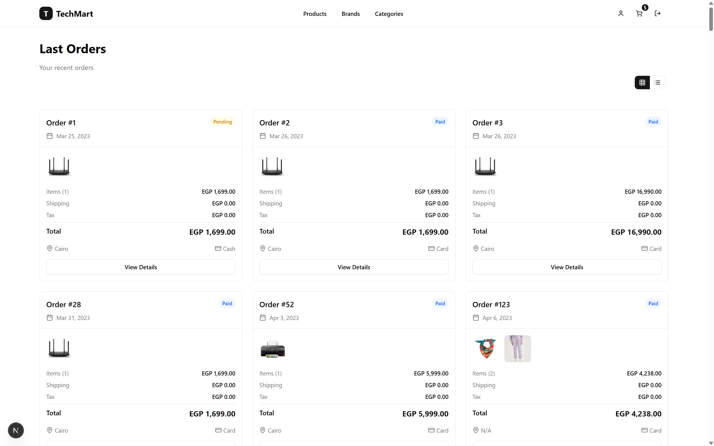

# 🛒 TechMart - Modern eCommerce Platform

[](https://nextjs.org/)
[](https://reactjs.org/)
[](https://www.typescriptlang.org/)
[](https://tailwindcss.com/)
[](LICENSE)

> A modern, responsive eCommerce platform built with Next.js 15, featuring a complete shopping experience with authentication, cart management, wishlist, and order tracking.

## ✨ Features

### 🛍️ **Core Shopping Features**

- **Product Catalog** - Browse products with advanced filtering and search
- **Product Details** - Detailed product pages with image galleries and specifications
- **Shopping Cart** - Add/remove items with quantity management
- **Wishlist** - Save favorite products for later
- **Order Management** - Complete order tracking and history
- **User Authentication** - Secure login/register with NextAuth.js

### 🎨 **User Experience**

- **Responsive Design** - Mobile-first approach with TailwindCSS
- **Modern UI** - Beautiful components built with Shadcn/ui
- **Fast Performance** - Optimized with Next.js 15 and Turbopack
- **Real-time Updates** - Live cart count and state management
- **Toast Notifications** - User feedback with react-hot-toast

### 🏪 **Store Management**

- **Categories & Brands** - Organized product browsing
- **Product Search** - Find products quickly
- **Rating System** - Customer reviews and ratings
- **Order Status** - Track order progress (Pending, Paid, Delivered)

## 🚀 Tech Stack

### **Frontend**

- **Next.js 15.5.2** - React framework with App Router
- **React 19.1.0** - UI library with latest features
- **TypeScript 5.0** - Type-safe development
- **TailwindCSS 4.0** - Utility-first CSS framework
- **Shadcn/ui** - Modern component library

### **State Management**

- **Redux Toolkit** - Predictable state container
- **React Redux** - React bindings for Redux

### **Authentication**

- **NextAuth.js 4.24.11** - Complete authentication solution

### **Form Handling**

- **React Hook Form 7.62.0** - Performant forms
- **Zod 4.1.8** - Schema validation
- **@hookform/resolvers** - Form validation integration

### **UI Components**

- **Radix UI** - Accessible component primitives
- **Lucide React** - Beautiful icons
- **Class Variance Authority** - Component variants

### **Development Tools**

- **ESLint** - Code linting
- **PostCSS** - CSS processing
- **Turbopack** - Fast bundling

## 📦 Installation

### Prerequisites

- Node.js 18+
- npm or yarn
- Git

### Clone the Repository

```bash
git clone https://github.com/yourusername/techmart-ecommerce.git
cd techmart-ecommerce
```

### Install Dependencies

```bash
npm install
# or
yarn install
```

### Environment Setup

Create a `.env.local` file in the root directory:

```env
# NextAuth Configuration
NEXTAUTH_URL=http://localhost:3000
NEXTAUTH_SECRET=your-secret-key

# API Configuration
NEXT_PUBLIC_API_URL=your-api-endpoint
```

## 🚀 Getting Started

### Development Server

```bash
npm run dev
# or
yarn dev
```

Open [http://localhost:3000](http://localhost:3000) in your browser to see the application.

### Build for Production

```bash
npm run build
# or
yarn build
```

### Start Production Server

```bash
npm start
# or
yarn start
```

## 📁 Project Structure

```
techmart-ecommerce/
├── 📁 src/
│   ├── 📁 app/                    # Next.js App Router
│   │   ├── 📁 (pages)/           # Route groups
│   │   │   ├── 📁 auth/          # Authentication pages
│   │   │   ├── 📁 products/      # Product pages
│   │   │   ├── 📁 cart/          # Shopping cart
│   │   │   ├── 📁 profile/       # User profile
│   │   │   └── 📁 allorders/     # Order history
│   │   ├── 📁 api/               # API routes
│   │   └── 📄 layout.tsx         # Root layout
│   ├── 📁 components/            # Reusable components
│   │   ├── 📁 layout/            # Layout components
│   │   ├── 📁 products/          # Product-related components
│   │   ├── 📁 ui/                # Shadcn/ui components
│   │   └── 📁 shared/            # Shared components
│   ├── 📁 redux/                 # State management
│   │   └── 📁 slices/            # Redux slices
│   ├── 📁 services/              # API services
│   ├── 📁 interfaces/            # TypeScript interfaces
│   ├── 📁 helpers/               # Utility functions
│   └── 📁 lib/                   # Library configurations
├── 📁 public/                    # Static assets
├── 📄 package.json
├── 📄 next.config.ts
├── 📄 tailwind.config.js
└── 📄 tsconfig.json
```

## 🎯 Key Features in Detail

### 🛒 Shopping Cart

- Add/remove products with real-time updates
- Quantity management with +/- controls
- Persistent cart state across sessions
- Cart count indicator in navigation

### ❤️ Wishlist

- Save products for later purchase
- Heart icon toggle for easy management
- Wishlist page with saved items
- Remove items with confirmation

### 📦 Order Management

- Complete order history
- Order status tracking (Pending, Paid, Delivered)
- Detailed order information
- Order details modal with full breakdown

### 🔐 Authentication

- Secure login/register forms
- Form validation with Zod schemas
- Protected routes and middleware
- Session management with NextAuth.js

## 🖼️ Screenshots

### Homepage


### Product Catalog


### Shopping Cart


### User Profile


### User Orders




## 🤝 Contributing

We welcome contributions! Please follow these steps:

1. **Fork the repository**
2. **Create a feature branch**
   ```bash
   git checkout -b feature/amazing-feature
   ```
3. **Commit your changes**
   ```bash
   git commit -m 'Add some amazing feature'
   ```
4. **Push to the branch**
   ```bash
   git push origin feature/amazing-feature
   ```
5. **Open a Pull Request**

### Development Guidelines

- Follow TypeScript best practices
- Use meaningful commit messages
- Write clean, readable code
- Test your changes thoroughly
- Update documentation as needed

## 📝 Available Scripts

| Script          | Description                             |
| --------------- | --------------------------------------- |
| `npm run dev`   | Start development server with Turbopack |
| `npm run build` | Build the application for production    |
| `npm run start` | Start production server                 |
| `npm run lint`  | Run ESLint for code quality             |

## 🐛 Bug Reports

Found a bug? Please create an issue with:

- Clear description of the problem
- Steps to reproduce
- Expected vs actual behavior
- Screenshots if applicable

## 💡 Feature Requests

Have an idea? We'd love to hear it! Please create an issue with:

- Detailed description of the feature
- Use cases and benefits
- Mockups or examples if possible

## 📄 License

This project is licensed under the MIT License - see the [LICENSE](LICENSE) file for details.

## 🙏 Acknowledgments

- [Next.js](https://nextjs.org/) - The React framework
- [TailwindCSS](https://tailwindcss.com/) - CSS framework
- [Shadcn/ui](https://ui.shadcn.com/) - Component library
- [Radix UI](https://www.radix-ui.com/) - Accessible components
- [Lucide](https://lucide.dev/) - Beautiful icons

---

<div align="center">
  <p>Made with ❤️</p>
  
  <p>
    <a href="#-techmart---modern-ecommerce-platform">⬆️ Back to top</a>
  </p>
</div>
